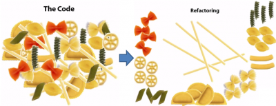

# Refactorizacion 
El término refactorizar dentro del campo de la Ingeniería del Software hace referencia a la modificación del código sin cambiar su funcionamiento. Se emplea para crear un código más claro y sencillo, facilitando la posterior lectura o revision de un programa. Se podría entender como el mantenimiento del código, para facilitar su comprensión, pero sin añadir ni eliminar funcionalidades. **Refactorizar código consiste en crear un código más limpio.**



La refactorización debe ser un paso aislado en el diseño de un programa, para evitar introducir errores de código al reescribir o modificar algunas partes del mismo. 
Si después de refactorizar hemos alterado el funcionamiento del código, hemos cometido errores al refactorizar.

Se refactoriza para:
* Limpieza del código, mejorando la consistencia y la claridad.
* Mantenimiento del código, sin corregir errores ni añadir funcionalidades.
* Elimina el código "muerto", y se modulariza.
* Facilita el futuro mantenimiento y modificación del código.

Los siguientes apartados están inevitablemente relacionados entre sí, ya que todas las técnicas o reglas persiguen el mismo fin.

## Convenciones de escritura de Java
Las convenciones de código existen debido a que la mayoría del coste del código de un programa se usa en su mantenimiento, (casi ningún programa se mantiene toda su vida con el código original), y mejoran la lectura del código permitiendo entender código nuevo mucho más rápido y a fondo.

En la web de [Sun Microsystems](http:`www.oracle.com/technetwork/java/codeconventions-150003.pdf) se recogen dichas convenciones.

Por su parte Google también ha creado recientemente una [guía de estilo](https:`google.github.io/styleguide/javaguide.html#s1-introduction) para Java.

Para que las convenciones funcionen, cada programador debe tratar de ser lo más fiel posible a estas.

## Ficheros ##
Todos los ficheros fuente de java son ficheros de texto plano cuyo nombre termina con la extensión `.java`

Dentro de cada fichero `.java` tenemos 4 partes en el siguiente orden:

- Posibles comentarios sobre la clase (autor, fecha, licencias, etc)
- Sentencia `package`. Toda clase debe estar en un paquete.
- Sentencias `import`. Importar cada clase en una linea separada.
- La definición de una única clase o interface *cuyo nombre es idéntico al nombre del fichero sin la extensión*.


  ```
  /* Correcto */                        /* Incorrecto */
  import java.awt.Frame;                import java.awt.*;
  import java.awt.Graphics;
  ```

Posteriormente dentro de la definición de la clase, aplicamos el siguiente orden:
- Sentencia `class o interface`
- Variables de clase (static)
- Variables de instancia (Atributos de la clase)
- Constructores (Si hay sobrecarga deben ir seguidos)
- Métodos (Si hay sobrecarga deben ir seguidos)

## Declaraciones de variables 
* Una sola declaración por linea.
  ```
  int edad;
  int cantidad;  
  ```
* Las variables locales se deben inicializar en el momento de declararlas o justo después. Se declaran justo antes de su uso, para reducir su ámbito.
* Las variables de instancia o de clase se declaran al comienzo de la definición de la clase.
* Los arrays se pueden inicializar en bloque:
  ```
  int[] array =
  {
  0, 1, 2, 3
  };
  ```
   ó

  ```
  int[] array = { 0, 1, 2, 3 };  
  ```
* Los arrays tienen los corchetes [ ] unidos a su tipo de datos:
  ```
  String[] nombres; `correcto
  String nombres[]; `incorrecto
  ```

## Nombres de identificadores
Para los identificadores podemos usar las letras anglosajonas y números de la tabla ASCII.

No se debe usar caracteres con tilde ni la (ñ). Las barras bajas o guiones tampoco se usan.

*Los nombres de los identificadores deben ser siempre lo más descriptivos posible, ya sea variable, método o clase*.

Solo se usan identificadores de un solo carácter para representar los contadores del bucle `for`, y comienzan en la letra `i`.

* Nombre de **Package**: siempre en minúsculas.
* Nombre de las **clases o interfaces**: `UpperCamelCase`.
* Nombre de los **métodos**: `lowerCamelCase`. Suelen ser verbos o frases.
* Nombres de **constantes**: `CONSTANT_CASE`. Todo el mayúsculas, separando con barra baja.
* **Variables locales, atributos de la clase, nombres de parámetros**: `lowerCamelCase`.

## Magic Numbers
Se conoce bajo este nombre a cualquier valor literal ("texto" o numérico) empleado en el código sin ninguna explicación.

Se deben sustituir siempre que se pueda por una constante que identifique su finalidad.

```
// incorrecto
int precioConIva = precioBase + (0.21 * precioBase);

// correcto
// Se define en la clase
final static double IVA = 0.21;
// Se utiliza en un método
int precioConIva = precioBase + (IVA * precioBase);
```

## Estructura del código
<details>
<summary>Descripción</summary>
* Debemos usar la codificación UTF-8
* En las sentencias de control de flujo (`if, else, for, do-while, try-catch-finally`) se incluyen llaves `{ }`, incluso si no contienen código o es una sola instrucción.
 Se alinean las llaves `{}` al inicio de línea.

  ```
  if (final < indice) {
    filaInicial = indice – numeroFilas;
  } else if (indice < filaInicial) {
    filaInicial = indice;
  }
  ```

* Una sola instrucción por linea.
* Las líneas de código no deben superar los 100 caracteres. Si no, se deben **romper** antes de algún operador.
* Si la declaración del método es demasiado larga, o una expresión aritmética es demasiado larga, o en una sentencia `if`, debo romper.
* Si una operación aritmética o lógica se compone de distintos tipos de operaciones con distinta jerarquía, se deben usar paréntesis para facilitar su legibilidad.
  ```
  public void ejecutarAccion(
    TipoParametro parametro1, TipoParametro parametro2, TipoParametro parametro3){
    ...
  }

  if ((condicion1 && condicion2)
    || (condicion3 && condicion4)
    || !(condicion5 && condicion6)) {
      llamarMetodo();
  }

  longName1 = longName2 * (longName3 + longName4 - longName5)
  + (4 * longname6);            // Siempre con el operador al principio de línea
  ```

* Los espacios en blanco mejoran la legibilidad. Se deben colocar entre operadores, después de los puntos y coma de los bucles for, después de los operadores de asignación, etc.
  ```
  cantidadTotal = cantidadInicial + cantidadFinal;

  for(int i = 0; i < cantidadTotal; i++){
    ...
  }

  public String getItem(int fila, int columna) {
    ...
  }

  getItem(cantidadInicial, cantidadFinal);
  ```

Debemos estar familiarizados y poner en práctica las convenciones recogidas en alguna de las guías de estilo indicadas.

</details>

## Bad Smells 
<details>
<summary>Descripción</summary>

Se conoce como **Bad Smell o Code Smell** [mal olor](https://es.wikipedia.org/wiki/Hediondez_del_c%C3%B3digo) a algunos indicadores o síntomas del código que posiblemente ocultan un problema más profundo.

Los `bad smells` no son errores de código (bugs), ya que no impiden que el programa funcione correctamente, pero son indicadores de fallos en el diseño del código que dificultan el posterior mantenimiento del mismo y aumentan el riesgo de errores futuros.

Algunos de estos síntomas son:

* **Código duplicado** (`Duplicated code`). Si se detectan bloques de código iguales o muy parecidos en distintas partes del programa, se debe extraer creando un método para unificarlo.

* **Métodos muy largos** (`Long Method`). Los método de muchas lineas dificultan su comprensión. Un método largo probablemente está realizando distintas tareas, que se podrían dividir en otros métodos. Las funciones deben ser los más pequeñas posibles (3 lineas mejor que 15). Cuanto más corto es un método, más fácil es reutilizarlo. __Un método debe hacer solo una cosa, hacerla bien, y que sea la única que haga.__

* **Clases muy grandes** (`Large class`). Problema anterior aplicado a una clase. Una clase debe tener solo una finalidad. Si una clase se usa para distintos problemas tendremos clases con demasiados métodos, atributos e incluso instancias. Las clases deben el menor numero de responsabilidades y que esté bien delimitado.

* **Lista de parámetros extensa** (`Long parameter list`). Las funciones (o métodos en Java) deben tener el mínimo número de parámetros posible, siendo 0 lo perfecto. Si un método requiere muchos parámetros puede que sea necesario crear una clase con esa cantidad de datos y pasarle un objeto de la clase como parámetro. Del mismo modo ocurre con el valor de retorno, si necesito devolver más de un dato.

* **Cambio divergente** (`Divergent change`). Si una clase necesita ser modificada a menudo y por razones muy distintas, puede que la clase esté realizando demasiadas tareas. Podría ser eliminada y/o dividida.

* **Cirugía a tiros** (`Shotgun surgery`). Si al modificar una clase, se necesitan modificar otras clases o elementos ajenos a ella para compatibilizar el cambio. Lo opuesto al `smell` anterior.

* **Envidia de funcionalidad** (`Feature Envy`). Ocurre cuando una clase usa más métodos de otra clase, o un método usa más datos de otra clase, que de la propia.

* **Legado rechazado** (`Refused bequest`). Cuando una subclase extiende (hereda) de otra clase, y utiliza pocas características de la superclase, puede que haya un error en la jerarquía de clases.

En la siguiente [página web](https://refactoring.guru/es/refactoring/smells) tenemos la mayoría de Bad Smells agrupados.

</details>

## Buenas prácticas ##

<details>
<summary>Descripción</summary>

* **Manejo de Strings**: Los Strings son objetos, por lo que crearlos es costoso. Es mucho más rápido instanciarlos con una asignación, que con el operador `new`.
    * Concatenar String con el operador '+' también genera mucha carga, ya que crea un nuevo String en memoria.
    * Se debe tratar de evitar siempre las concatenaciones (+) dentro de un **bucle**, o usar otras clases en ese caso (p.e. StringBuilder)
      ```
      // instanciación lenta
      String lenta = new String("objeto string");

      // instanciación rápida
      String rapida = "objeto string";
      ```
      
* *Tipos primitivos mejor que clases `wrapper` (envoltorio)*: Las clases wrapper al ser objetos, proveen de métodos para trabajar mejor con ellas, pero al igual que los Strings, son más lentos que los tipos primitivos.

* *Comparación de objetos*: Recordar que tanto los `Strings` como las tipos `Wrapper` son objetos y sus variables solo contienen sus referencias (direcciones).

* Evitar la creación innecesaria de objetos. Como se ha dicho, generan mucha carga.
  ```
  int x = 10;
  int y = 10;

  Integer x1 = new Integer(10);
  Integer y1 = new Integer(10);

  String x2 = "hola";
  String y2 = new String("hola");

  System.out.println(x == y);    // TRUE
  System.out.println(x1 == y1);  // FALSE, ya que son 2 objetos distintos
  System.out.println(x2 == y2);  // FALSE, ya que son 2 objetos distintos
  ```

* **Visibilidad de atributos**: Los campos de una clase 'estándar' no deben declararse nunca como public, ni mucho menos no indicarle un modificador de visibilidad. Se usan sus `setters y getters` para su acceso.

* **Limitar siempre el alcance de una variable local**. Crear la variable local e inicializarla lo más cerca posible de su uso.

* **Usar siempre una variable para un único propósito**. A veces sentimos la tentación de reutilizar una variable, pero complica la legibilidad.

  ```
  ...
  int resultadoTotal = resultadoInicial - resultadoFinal;
  ...
  ```

* **Bucle for**. Optar por el `for` siempre que se pueda (frente a while, do-while). Las ventajas son que reune todo el control del bucle en la misma linea (inicio, fin, e incremento), y la variable de control ('i') no es accesible desde fuera de él. Si se necesita modificar su variable de control, usar otro bucle.

* **Constantes**: Cualquier valor literal debe ser definido como constante, excepto 1, -1, 0 ó 2 que son usados por el bucle for.

* **Switch**: Siempre debe llevar un `break` despues de cada caso, y tambien el caso `default` que ayudará a corregir futuros aumentos del número de casos.

* El `copiado defensivo` es salvador. Cuando creamos un constructor que recibe el mismo tipo de objeto de la clase, debemos tener cuidado y crear un nuevo objeto a partir del recibido.
</details>

## Refactorización en IntelliJ

<details>
<summary>Descripción</summary>

IntelliJ tiene distintos [métodos de refactorización](https://www.jetbrains.com/help/idea/refactoring-source-code.html)

Dependiendo de sobre qué mostremos el menú de refactorización, nos ofrecerá unas u otras opciones.

Para refactorizar pulsaremos click derecho sobre el nombre del elemento deseado, y deplegaremos la opción *Refactor* del menu contextual.

Los **métodos de refactorización**, también llamados **patrones de refactorización**, nos permiten plantear casos y previsualizar las posibles soluciones que se nos ofrecen.

Podemos seleccionar diferentes elementos para mostrar su menú de refactorización (una clase, una variable, método, bloque de instrucciones, expresion, etc ). A continuación se muestras algunos de los métodos más comunes:

* **Rename**: Es la opción empleada para cambiar el identificador a cualquier elemento (nombre de variable, clase, método, paquete, directorio, etc). Cuando lo aplicamos, se cambian todas las veces que aparece dicho identificador.

* **Move**: Mueve una clase (fichero .java)de un paquete a otro y se cambian todas las referencias. También se realiza la misma operación arrastrando la clase de un paquete a otro en el explorador de eclipse.

* **Extract Constant**: Convierte un número o cadena literal en una constante. Se puede ver donde se realizarán los cambios, y también el estado antes y después de refactorizar. Después, todas las apariciones de esa cadena se sustituyen por el nombre de la constante. Esto se utiliza modificar el valor en un solo lugar.

* **Extract Local Variable**: Convierte un número o cadena literal en una variable de ámbito local. Si esa misma cadena de texto existe fuera del bloque o del método, no se aplica el cambio. Parecido al patrón anterior, pero para aplicar dentro de método o bloques de código entre llaves { }.

* **Convert Local Variable to Field**: Convierte una variable local en un atributo privado de la clase. Después de aplicar el patrón de refactorización, todos los usos de la variable local se sustituyen por el atributo.

* **Extract Method**: Convierte un bloque de código en un método, a partir de un bloque cerrado por llaves { }. Eclipse ajusta las parámetros y el retorno del método. Es muy útil cuando detectamos `bad smells` en métodos muy largos, o en bloques de código que se repiten.

* **Change Method Signature**: Permite cambiar el nombre del método y los parámetros que recibe. Se actualizarán todas las dependencias y llamadas al método dentro del proyecto actual.

* **Inline**: Nos permite ajustar una referencia a una variable o método en una sola linea de código.
  ```
  File fichero = new File("datos.dat");
  PrintWriter escritor;
  escritor = new PrintWriter(fichero);

  PrintWriter escritor = new PrintWriter(new File("datos.dat"));
  ```
  
* **Extract Interface**: Este patrón de refactorización nos permite seleccionar los métodos de una clase para crear una `Interface`. Una `Interface` es una plantilla que define los métodos acerca de lo que puede hacer una clase. Define los métodos de una clase (Nombre, parámetros y tipo de retorno) pero no los desarrolla.

* **Extract Superclass**: Permite crear una superclase (clase padre) con los métodos y atributos que seleccionemos de una clase concreta. Lo usamos cuando la clase con la que trabajamos podría tener cosas en común con otras clases, las cuales serían también subclases de la superclase creada.
</details>

----
(c) Fernando Valdeón