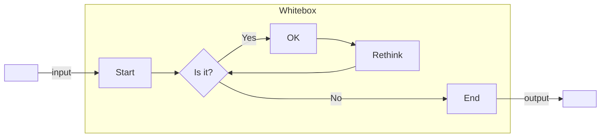

# Diseño de Pruebas

La etapa de pruebas de software (*software testing*) es un proceso más dentro del **desarrollo de software**.

Sirve para mantener un control de calidad sobre el producto que creamos, y aunque requiera tiempo al igual que programar, a la larga el software mal programado acaba saliendo demasiado caro.

## ¿Qué se prueba? (Caso de Prueba)

Un caso de prueba (*test case*) es una situación, contexto o escenario bajo el que se comprueba una funcionalidad de un programa o un método para ver si se comporta de la forma en qué se espera.

Por ejemplo, *un videojuego de plataformas; cuando el personaje cae al agua el jugador pierde una vida y el nivel se reinicia*.

- **Objeto de la prueba**: asegurarnos que cuando el personaje cae al agua, ocurre lo esperado
- **Caso prueba**: llevas al personaje a un punto de la pantalla donde pueda caer al agua

En programación, el caso de prueba puede estar planteado por los parámetros que recibe un método o el estado de los datos del programa a la hora de ejecutar el método.

Otro ejemplo, `int Math.abs(int num)` devuelve un `int` con el valor absoluto del parámetro `num`.

Si `num > 0`, devuelve `num`, si `num < 0`, devuelve `num`.

- **Objeto de la prueba**: asegurarnos que `Math.abs()` devuelve el valor absoluto
- **Caso de prueba**: si calculo el valor absoluto de `-7` debe dar `7`

> Un caso de prueba *es una pregunta que se le hace al programa para saber si el programa contesta (reacciona) correctamente*

## Tipos de pruebas según su enfoque

### Caja Negra


Son las pruebas que se centran en evaluar el valor de las salidas de un sistema a partir de unas entradas concretas, sin tener en cuenta el funcionamiento interno del sistema.

Se centran en el **qué** hace un sistema y no en el **cómo** lo hace.

> *El programador no necesita saber cómo funciona el código, sino evaluar solamente la salida*.

Este tipo de test se puede aplicar a cualquier nivel de testeo de software: pruebas *unitarias*, de *integración*, de *aceptación*, etc.

### Caja Blanca
    



Estos tipos de pruebas se centran en analizar cada uno de los posibles caminos en el flujo de ejecución de un programa antes unos valores de entrada concretos.

*Es decir, si ante unos valores de entrada (parámetros) de un método, el flujo del programa ejecuta los if, o los else, o entra en un bucle, o sale de él*.

Las pruebas de Caja Blanca también se pueden aplicar a las pruebas *unitarias*, pruebas de *integración* o de *sistema*.

## Tipos de pruebas según su alcance

### Pruebas Unitarias
Una prueba unitaria es un tipo de prueba enfocada en verificar una sección específica dentro del código de un programa.

En programación orientada a objetos se realiza en cada clase y se centra en los métodos de cada clase.

Las pruebas unitarias son código (`Java`, `C#`, etc.) escrito normalmente al mismo tiempo que se va desarrollando el programa (enfoque Caja Blanca).

Un método creado en el programa, puede tener distintas pruebas unitarias.

Por sí misma no asegura el funcionamiento completo del programa, pero sin embargo, nos indican que los bloques de software que vamos creando funcionan independientemente de los otros.

Para realizar pruebas unitarias tenemos herramientas parecidas para cada lenguaje o plataforma:
- JUnit para Java
- PHPUnit para PHP
- CPPUnit para C++
- NUnit para .NET
- CUnit para C
- PyUnit para Python

### Pruebas de Integración
Las pruebas de integración es una fase en el proceso de pruebas de software, en la que se combinan los distintos módulos de software de un programa y se comprueba que trabajan de forma conjunta.

Se realizan después de la fase de pruebas unitarias y se centran principalmente en probar la comunicación entre los componentes y sus comunicaciones, ya sea hardware o software.

Los tests de integración prueban que el sistema *completo* funciona como se espera.

> Por ejemplo, una interfaz gráfica y la aplicación con la que trabaja, una aplicación de acceso a datos y el módulo que trabaja un gestor de bases de datos, etc.

### Pruebas de Usabilidad
Las pruebas de usabilidad consisten en seleccionar a un grupo de usuarios de una aplicación y solicitarles que lleven a cabo las tareas para las cuales fue diseñada.

Posteriormente los desarrolladores involucrados toman nota de la interacción, particularmente de los errores y dificultades con las que se encuentren los usuarios. Este tipo de pruebas no se implementan con software, sino con encuestas de uso o herramientas similares.

No es necesario que se trate de una aplicación completamente terminada, pudiendo tratarse de un prototipo o de las distintas etapas de avance de un proyecto.

---

## JUnit 


Es un framework para Java enfocado en la realización de **pruebas unitarias** (*unit testing*).

Consiste en unas librerías JAR que debemos añadir a un proyecto en Java.

[Página oficial](http://www.junit.org)

JUnit5 ofrece herramientas para poder ejecutar tests de las versiones anteriores (JUnit4 y JUnit3), por lo que JUnit5 puede ejecutar tests escritos en las versiones anteriores.

En la [API de JUnit5](https://junit.org/junit5/docs/current/api/org.junit.jupiter.api/org/junit/jupiter/api/package-summary.html), encontraremos los métodos para implementar nuestros casos de prueba:


Ejemplo de clase de pruebas:
```java
public class ClaseTest {

	@BeforeAll
	public static void setUpBeforeClass() throws Exception {
		//Codigo que se ejecuta antes de cualquier prueba
	}

	@BeforeEach
	public void setUp() throws Exception {
		//Codigo que se ejecuta antes de cada prueba		
	}

	@Test
	public void test1() {
		//Caso de prueba
	}

	@Test
	public void test2() {
		//Caso de prueba		
	}
	
	@Test
	public void test3() {
		//Caso de prueba
	}

	@AfterEach
	public void tearDown() throws Exception {
		//Metodo que se ejecuta después de cada prueba 
	}

	
	@AfterAll
	public static void tearDownAfterClass() throws Exception {
		//Codigo que se ejecuta después de todas las pruebas
	}
}
```

### Qué cosas se deben probar
Los tests unitarios se usan para evitar el miedo a que algo se *rompa*. Cualquier método que no tengamos claro si funciona de forma correcta o no, es un método susceptible de ser probado de forma unitaria.

Los métodos `getters` y `setters` normalmente son tan sencillos que no suelen albergar dudas, pero si hay alguna razón para que no funcionen, entonces también se deben probar.

> Se debe probar todas las cosas no nos inspiren confianza, basándonos en nuestro criterio.

Una buena aproximación es realizar una prueba __afirmativa__ y otra __negativa__ para cada requisito.

Una prueba para evaluar que un requisito funciona adecuadamente, y otra para evaluar lo contrario.

En caso de querer comprobar todos los requisitos de un programa se deben al menos plantear **dos** casos de prueba para cada requisito o funcionalidad: __una prueba afirmativa__ y __una prueba negativa__.

> [!NOTE]
> Piensa en alguno de los métodos que ya implementaste y que probarías

### Métodos de prueba vs Casos de prueba

Un método de prueba es simplemente un fragmento de código que realiza una comprobación sobre una funcionalidad de un programa.

> [!IMPORTANT]
> Para que un método sea un método de prueba debe estar precedido por la anotación `@Test`

Un caso de prueba (*test case*), como hemos dicho es una situación o caso (un estado concreto del programa) bajo el que se prueba una funcionalidad del programa.

Nosotros vamos a intentar que cada método de prueba plantee únicamente un caso de prueba distinto, ya que un programa puede funcionar de formas distintas dependiendo del contexto.

Los métodos de prueba se agrupan atendiendo a su finalidad en *clases de prueba*.

Estas clases se suelen emplazar en un `package` distinto al resto de las clases, por ejemplo: `src/tests`

Si tenemos una clase `Matematicas` con distintos métodos:
```java
public class Matematicas{
   public static int suma(int num1, int num2){
      return num1 + num2;
   }
}
```

Podríamos tener una clase de pruebas para la clase `Matematicas`:
```java
public class MatematicasTest{
   @Test
   public void testSuma(){
      assertEquals(5, Matematicas.suma(2,3));
   }
}
```

### Características de un caso de prueba:
1. **Probar una sola cosa**
2. **Tener un propósito claro**
3. **Estar escrito de la forma más clara posible**
4. **Ser lo más pequeño posible**
5. **Ser independiente: no debe depender de otros casos de prueba**
6. **Poder ser repetido las veces necesarias**

### Anotaciones de JUnit 5:

| Anotación      | Descripción                                                                                       |
|----------------|---------------------------------------------------------------------------------------------------|
| `@Test`        | Indica que el método es un test.                                                                 |
| `@DisplayName` | Indica un nombre para el test class o el test method.                                            |
| `@Tag`         | Define etiquetas para filtrar por tests.                                                         |
| `@BeforeEach`  | Se aplica a un método para indicar que se ejecute antes de cada método de prueba.                |
| `@AfterEach`   | Se aplica a un método para indicar que se ejecuta después de cada método de prueba.               |
| `@BeforeAll`   | Se aplica a un método static para indicar que se ejecuta antes que todos los métodos de prueba de la clase. |
| `@AfterAll`    | Se aplica a un método static para indicar que se ejecuta después que todos los métodos de prueba de la clase. |
| `@Disable`     | Se aplica a un método de prueba para evitar esa prueba.                                           |

### Métodos de la clase Assertions de JUnit:

| Método                                                       | Descripción                                                                                            |
|--------------------------------------------------------------|--------------------------------------------------------------------------------------------------------|
| `assertTrue(boolean valor)`                                 | Falla si `valor` no es true.                                                                           |
| `assertFalse(boolean valor)`                                | Falla si `valor` no es false.                                                                          |
| `assertFalse(boolean valor, String mensaje)`                | Falla si `valor` no es false y muestra el `mensaje`.                                                    |
| `assertEquals(int esperado, int actual)`                    | Falla si `esperado` es distinto de `actual`.                                                           |
| `assertEquals(int esperado, int actual, String mensaje)`    | Falla si `esperado` es distinto de `actual` y muestra el `mensaje`.                                     |
| `assertEquals(double esperado, double actual, double delta)` | Falla si la diferencia entre `esperado` y `actual` es mayor a `delta`.                                   |
| `assertNull(Object obj)`                                    | Falla si `obj` es distinto de `null`.                                                                  |
| `assertNotNull(Object obj)`                                 | Falla si `obj` es `null`.                                                                              |
| `assertEquals(Object esperado, Object actual)`              | Falla si los objetos son distintos, evaluando su método `equals()`.                                     |
| `assertNotEquals(Object esperado, Object actual)`           | Falla si los objetos no son distintos, evaluando su método `equals()`.                                  |
| `assertSame(Object esperado, Object actual)`                | Falla si las referencias de los objetos son distintas.                                                  |


## Implementación de Tests en IntelliJ IDEA

[Configuración previa](https://www.jetbrains.com/help/idea/testing.html) en el IDE IntelliJ IDEA.


